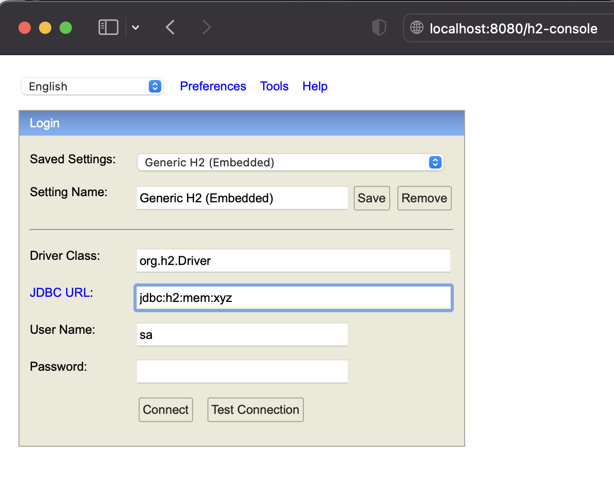
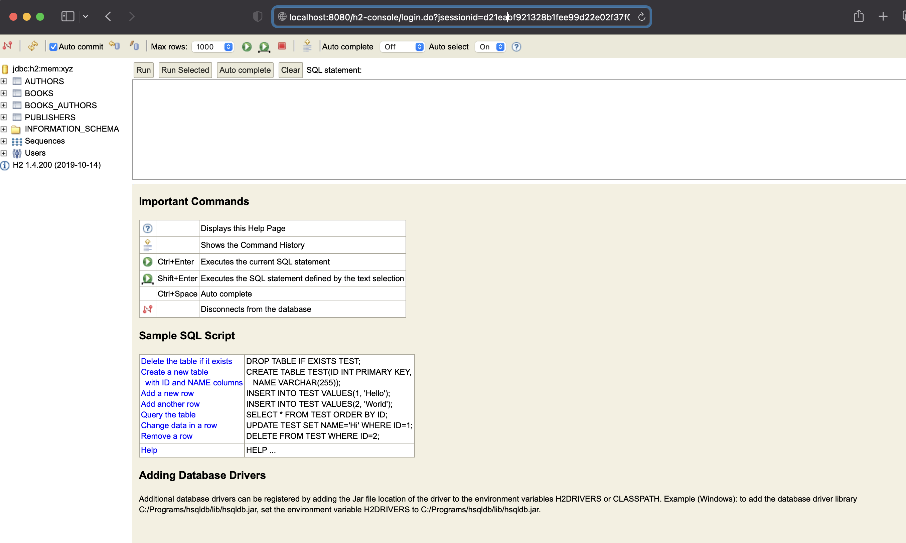
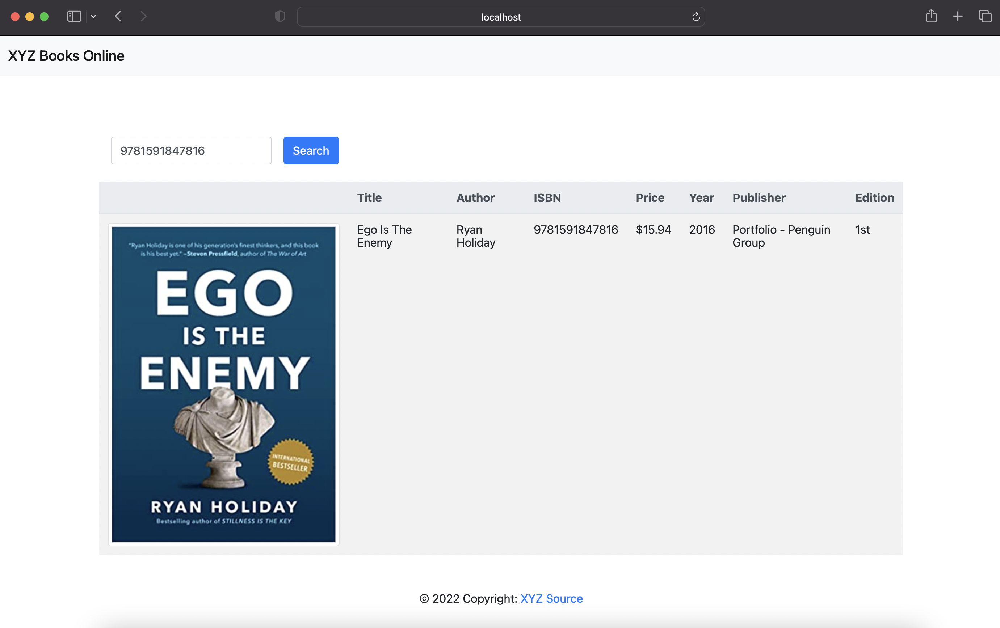

# Quick Guide

### How To Run

Following are the steps to run:

* Clone this repository. Execute `git clone https://github.com/rburawes/xyz-books.git`.
* Go to root directory of the project and execute `mvn clean install -U`.
* Run the application by executing `java -jar target/xyz-books-0.0.1-SNAPSHOT.jar` or `./mvnw spring-boot:run`.
* Open your browser and go to `http://localhost:8080`.
* Start testing the search book by `ISBN10` or `ISBN13`.
* `ctrl + c` to exit or stop the application.

### Data

The application is using H2 in-memory database.

* During application startup the database will be created automatically and will load the data from [data.sql](src/main/resources/data.sql).
* To view the tables and data go to `http://localhost:8080/h2-console` once the application is already running. Use the following details: `Driver Class = org.h2.Driver, JDBC Url = jdbc:h2:mem:xyz, User Name: sa, Password = <empty>`.

* List of books can also be viewed through this API `http://localhost:8080/api/v1/books`.

### API

These are the available APIs.

* `http://localhost:8080/api/v1/books/isbn/{isbn}` - Search book using ISBN10 or ISBN13 (see [index.html](src/main/resources/templates/index.html)).

* `http://localhost:8080/api/v1/books/title/{title}` - Search books using title (JSON format).
* `http://localhost:8080/api/v1/books` - View all books (JSON format only).

### Tools

* Spring Boot - Backend side.
* Thymeleaf, Bootstrap 4, jQuery - Front-end
* Spring Data JPA - Persistence/ORM
  

